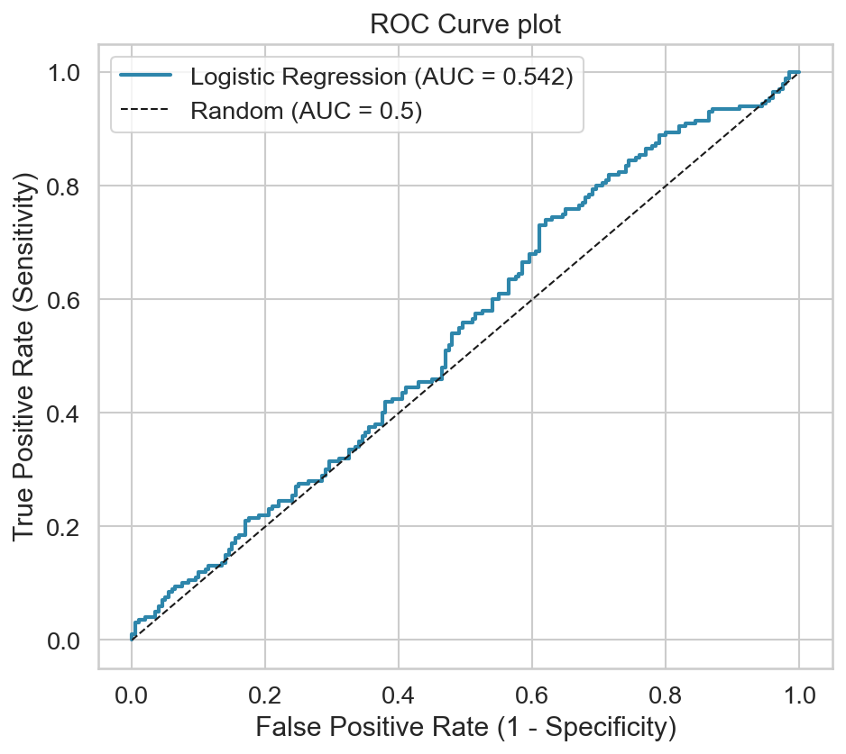
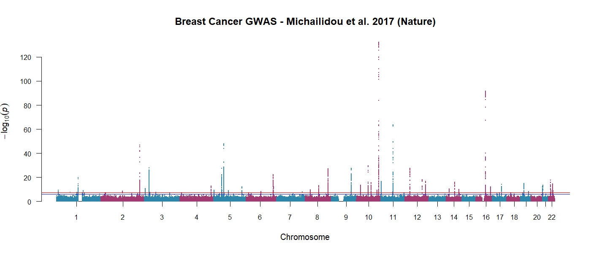

# Breast Cancer Polygenic Risk Score Analysis

## Overview
Reproducible R and Python pipeline analysing publicly available GWAS summary statistics from Michailidou et al. (2017, Nature), n = 122,977 cases, 105,974 controls. Calculating simulated PRS using logistic regression from the effect sizes obtained from Michailidou et al, 2017 achieving AUC = 0.542, consistent with modest predictive power expected for complex polygenic traits.

## Results

## R Pipeline
The R script preprocessed the GWAS data and obtained the descriptive statistics and summary plots such as Manhattan plot, QQ plot, effect size distribution plots to further export a clean SNP table

## Python Pipeline
The python notebook visualized the GWAS effect size landscape, simulated PRS using real GWAS effect sizes, performed logistic regression classification of cases vs controls and evaluated the accuracy of the model using AUC-ROC curve.

## Limitations
-lack of individual genetic data access
-No LD clumping and thresholding applied, correlated SNPs counted multiple times
-European ancestry only

## Data
Michailidou et al. (2017), Nature, 551:92-94.
Downloaded from: https://www.ccge.medschl.cam.ac.uk/breast-cancer-association-consortium-bcac/data-data-access/summary-results/gwas-summary-results

## Skills demonstrated
R · Python · GWAS analysis · Quality control · Polygenic risk scores · Logistic regression · Scikit-learn · ggplot2 · Data visualisation
